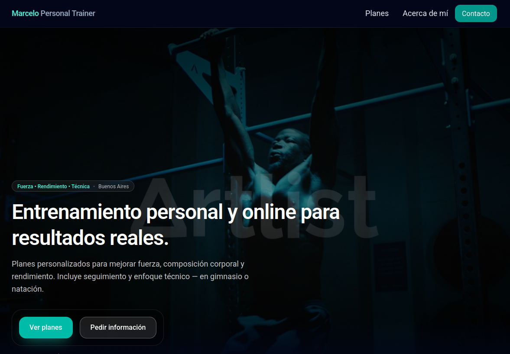

# Gym Trainer Website

Modern responsive website for a personal trainer based in Buenos Aires.

This project was developed as a portfolio piece and as a real website for a fitness coach offering strength training and swimming technique coaching.

---

## Features

- Responsive design (mobile-first)
- Full-width cinematic hero section with background video
- Contact form with API endpoint
- Training plans page
- About page
- Modern dark UI built with TailwindCSS
- Optimized layout for client conversion

---

## Tech Stack

- **Next.js (App Router)**
- **React**
- **Tailwind CSS**
- **TypeScript**
- **Vercel (deployment ready)**

---

## Project Structure
app/
about/
contact/
plans/
api/contact/

components/
Navbar.tsx
Footer.tsx
ContactForm.tsx

public/
excercise.mp4

---

## Getting Started

Clone the repository:
git clone https://github.com/elvilla/gym-trainer-website.git

Install dependencies:
npm install

Run the development server:
npm run dev

Open in browser:
http://localhost:3000

---

## Contact Form

The site includes a server-side API route:
/app/api/contact/route.ts

The form currently stores and processes contact requests during development and can easily be extended to integrate with:

- email services
- CRM systems
- messaging services

---

## Deployment

The project is ready for deployment on **Vercel**.

Typical workflow:
git push
→ Vercel auto deploy

---

## Author

Martin Villarreal

---

## License

MIT License